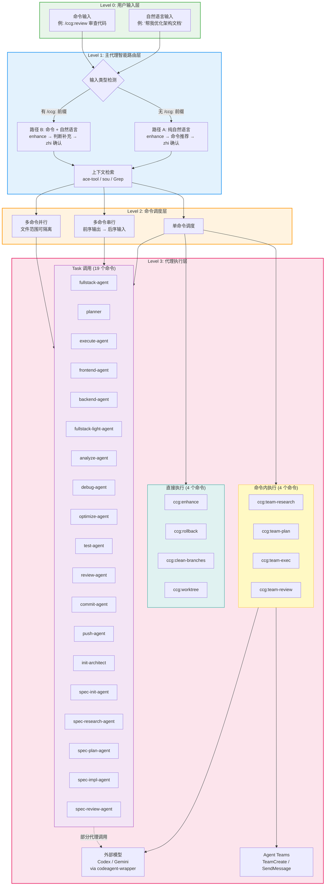
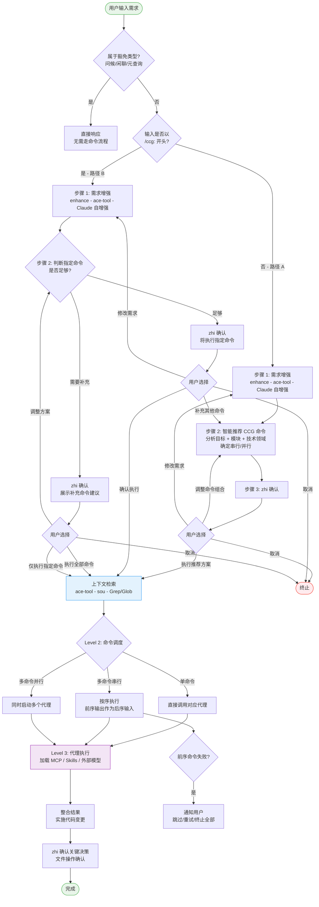
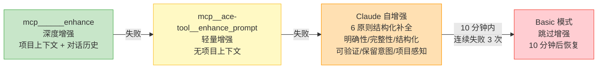
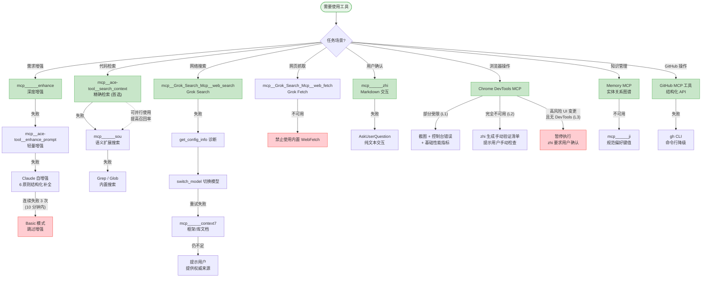

# CCG 架构可视化

> **版本**: v1.0.0 | **更新日期**: 2026-02-19
>
> 本文件提供 CCG 系统的完整架构可视化，包含 Mermaid 图表和配置矩阵。
> 由 [CLAUDE.md](../../../CLAUDE.md) 和 [ARCHITECTURE.md](./ARCHITECTURE.md) 引用。

---

## 目录

- [系统三层架构图](#系统三层架构图)
- [命令调用流程图](#命令调用流程图)
- [6 阶段工作流图](#6-阶段工作流图)
- [命令-代理映射矩阵](#命令-代理映射矩阵)
- [代理工具集配置矩阵](#代理工具集配置矩阵)
- [工具选择决策树](#工具选择决策树)

---

## 系统三层架构图

[返回目录](#目录) | [ARCHITECTURE.md - 系统概览](./ARCHITECTURE.md#系统概览)

CCG 采用四层执行模型（Level 0 - Level 3），所有用户输入统一经过智能路由后分发执行。

### 层级职责说明

| 层级 | 职责 | 关键机制 |
|------|------|----------|
| **Level 0** | 接收用户输入（自然语言或 `/ccg:` 命令） | 统一入口 |
| **Level 1** | 需求增强 + 命令推荐 + 用户确认 | level1-gate Skill、enhance 降级链、断路器模式 |
| **Level 2** | 根据确认结果调度命令执行 | 单命令/串行/并行三种模式 |
| **Level 3** | 代理加载工具完成任务 | Task 调用、直接执行、命令内执行三种方式 |

---

## 命令调用流程图

[返回目录](#目录) | [ARCHITECTURE.md - 协作流程](./ARCHITECTURE.md#协作流程)

完整展示从用户输入到代理执行的全流程，包含路径 A/B 分支和降级处理。

### enhance 降级链详情

---

## 6 阶段工作流图

[返回目录](#目录) | [ARCHITECTURE.md - 协作流程](./ARCHITECTURE.md#协作流程)

`ccg:workflow` 命令的完整 6 阶段结构化开发工作流，由 `fullstack-agent` 执行。

```mermaid
flowchart TB
    subgraph S1["阶段 1: 研究 (Research)"]
        direction TB
        S1_IN["输入: 用户需求 + 项目上下文"]
        S1_CODEX["Codex 并行分析<br/>后端架构 / 数据模型 / API"]
        S1_GEMINI["Gemini 并行分析<br/>前端组件 / UI/UX / 交互"]
        S1_OUT["输出: 双模型研究报告"]
        S1_DIR[".doc/workflow/research/"]

        S1_IN --> S1_CODEX
        S1_IN --> S1_GEMINI
        S1_CODEX --> S1_OUT
        S1_GEMINI --> S1_OUT
    end

    subgraph S2["阶段 2: 构思 (Ideation)"]
        direction TB
        S2_IN["输入: 双模型研究报告"]
        S2_CLAUDE["Claude 综合分析<br/>识别共识与分歧<br/>评估技术可行性"]
        S2_OUT["输出: 技术方案选型"]
        S2_DIR[".doc/workflow/wip/analysis/"]

        S2_IN --> S2_CLAUDE
        S2_CLAUDE --> S2_OUT
    end

    subgraph S3["阶段 3: 计划 (Planning)"]
        direction TB
        S3_IN["输入: 技术方案"]
        S3_CLAUDE["Claude 生成计划<br/>WBS 任务分解<br/>依赖关系 + 风险评估"]
        S3_ZHI["zhi 确认计划"]
        S3_OUT["输出: Step-by-step 实施计划"]
        S3_DIR[".doc/workflow/plans/"]

        S3_IN --> S3_CLAUDE
        S3_CLAUDE --> S3_ZHI
        S3_ZHI --> S3_OUT
    end

    subgraph S4["阶段 4: 执行 (Execution)"]
        direction TB
        S4_IN["输入: 实施计划"]
        S4_CLAUDE["Claude 实施代码变更<br/>Read/Edit/Write/Bash<br/>调用 MCP 工具"]
        S4_ZHI["zhi 确认文件操作"]
        S4_OUT["输出: 代码变更集"]
        S4_DIR[".doc/workflow/wip/execution/"]

        S4_IN --> S4_CLAUDE
        S4_CLAUDE --> S4_ZHI
        S4_ZHI --> S4_OUT
    end

    subgraph S5["阶段 5: 审查与修复 (Review and Fix)"]
        direction TB
        S5_IN["输入: 代码变更集"]
        S5_CODEX["Codex 审查<br/>安全性 / 性能"]
        S5_GEMINI["Gemini 审查<br/>可维护性 / UI/UX"]
        S5_FIX["Claude 修复问题<br/>Critical 必须修复"]
        S5_OUT["输出: 审查通过的代码"]
        S5_DIR[".doc/workflow/wip/review/"]

        S5_IN --> S5_CODEX
        S5_IN --> S5_GEMINI
        S5_CODEX --> S5_FIX
        S5_GEMINI --> S5_FIX
        S5_FIX --> S5_OUT
    end

    subgraph S6["阶段 6: 验收 (Acceptance)"]
        direction TB
        S6_IN["输入: 审查通过的代码"]
        S6_CLAUDE["Claude 最终验收<br/>端到端测试<br/>文档更新"]
        S6_ZHI["zhi 用户验收确认"]
        S6_OUT["输出: 已交付的功能"]
        S6_DIR[".doc/workflow/wip/acceptance/"]

        S6_IN --> S6_CLAUDE
        S6_CLAUDE --> S6_ZHI
        S6_ZHI --> S6_OUT
    end

    S1 --> S2
    S2 --> S3
    S3 --> S4
    S4 --> S5
    S5 --> S6

    style S1 fill:#e8eaf6,stroke:#3f51b5,stroke-width:2px
    style S2 fill:#e0f7fa,stroke:#00bcd4,stroke-width:2px
    style S3 fill:#f3e5f5,stroke:#9c27b0,stroke-width:2px
    style S4 fill:#e8f5e9,stroke:#4caf50,stroke-width:2px
    style S5 fill:#fff3e0,stroke:#ff9800,stroke-width:2px
    style S6 fill:#fce4ec,stroke:#e91e63,stroke-width:2px
```

### 阶段详情

| 阶段 | 负责模型 | 关键工具 | 输入 | 输出 | 文档目录 |
|------|----------|----------|------|------|----------|
| 1. 研究 | Codex + Gemini (并行) | codeagent-wrapper, ace-tool, Grok Search | 用户需求 + 项目上下文 | 双模型研究报告 | `.doc/workflow/research/` |
| 2. 构思 | Claude | ace-tool, ji | 双模型研究报告 | 技术方案选型 | `.doc/workflow/wip/analysis/` |
| 3. 计划 | Claude | zhi, ji | 技术方案 | Step-by-step 实施计划 | `.doc/workflow/plans/` |
| 4. 执行 | Claude | Read/Edit/Write/Bash, context7, GitHub MCP | 实施计划 | 代码变更集 | `.doc/workflow/wip/execution/` |
| 5. 审查 | Codex + Gemini (并行) 然后 Claude 修复 | codeagent-wrapper, Chrome DevTools | 代码变更集 | 审查通过的代码 | `.doc/workflow/wip/review/` |
| 6. 验收 | Claude | zhi, Bash (测试) | 审查通过的代码 | 已交付的功能 | `.doc/workflow/wip/acceptance/` |

---

## 命令-代理映射矩阵

[返回目录](#目录) | [ARCHITECTURE.md - 命令-代理映射表](./ARCHITECTURE.md#命令-代理映射表)

27 个 CCG 命令按执行方式分为三组。

### 分组可视化

```mermaid
graph LR
    subgraph TASK_GROUP["Task 调用 (19 个命令)"]
        direction TB
        T01["ccg:workflow -- fullstack-agent"]
        T02["ccg:plan -- planner"]
        T03["ccg:execute -- execute-agent"]
        T04["ccg:frontend -- frontend-agent"]
        T05["ccg:backend -- backend-agent"]
        T06["ccg:feat -- fullstack-light-agent"]
        T07["ccg:analyze -- analyze-agent"]
        T08["ccg:debug -- debug-agent"]
        T09["ccg:optimize -- optimize-agent"]
        T10["ccg:test -- test-agent"]
        T11["ccg:review -- review-agent"]
        T12["ccg:commit -- commit-agent"]
        T13["ccg:push -- push-agent"]
        T14["ccg:init -- init-architect"]
        T15["ccg:spec-init -- spec-init-agent"]
        T16["ccg:spec-research -- spec-research-agent"]
        T17["ccg:spec-plan -- spec-plan-agent"]
        T18["ccg:spec-impl -- spec-impl-agent"]
        T19["ccg:spec-review -- spec-review-agent"]
    end

    subgraph DIRECT_GROUP["直接执行 (4 个命令)"]
        direction TB
        D1["ccg:enhance<br/>主代理调用 enhance 工具"]
        D2["ccg:rollback<br/>主代理交互式 Git 回滚"]
        D3["ccg:clean-branches<br/>主代理清理 Git 分支"]
        D4["ccg:worktree<br/>主代理管理 Git Worktree"]
    end

    subgraph INTERNAL_GROUP["命令内执行 (4 个命令)"]
        direction TB
        I1["ccg:team-research<br/>主代理 + Codex/Gemini"]
        I2["ccg:team-plan<br/>主代理 + Codex/Gemini"]
        I3["ccg:team-exec<br/>主代理 + TeamCreate"]
        I4["ccg:team-review<br/>主代理 + Codex/Gemini"]
    end

    style TASK_GROUP fill:#f3e5f5,stroke:#9c27b0,stroke-width:2px
    style DIRECT_GROUP fill:#e0f2f1,stroke:#009688,stroke-width:2px
    style INTERNAL_GROUP fill:#fff9c4,stroke:#fbc02d,stroke-width:2px
```

### 完整映射表

| # | CCG 命令 | 执行方式 | 调用的代理 | 说明 |
|---|----------|----------|------------|------|
| 1 | `ccg:workflow` | Task 调用 | `fullstack-agent` | 6 阶段全栈开发工作流 |
| 2 | `ccg:plan` | Task 调用 | `planner` | WBS 任务分解规划 |
| 3 | `ccg:execute` | Task 调用 | `execute-agent` | 严格按计划执行 |
| 4 | `ccg:frontend` | Task 调用 | `frontend-agent` | 前端专项开发（Gemini 主导） |
| 5 | `ccg:backend` | Task 调用 | `backend-agent` | 后端专项开发（Codex 主导） |
| 6 | `ccg:feat` | Task 调用 | `fullstack-light-agent` | 智能功能开发（自动识别前/后/全栈） |
| 7 | `ccg:analyze` | Task 调用 | `analyze-agent` | 多模型技术分析 |
| 8 | `ccg:debug` | Task 调用 | `debug-agent` | 假设驱动缺陷定位 |
| 9 | `ccg:optimize` | Task 调用 | `optimize-agent` | 性能分析与优化 |
| 10 | `ccg:test` | Task 调用 | `test-agent` | 测试用例生成 + E2E |
| 11 | `ccg:review` | Task 调用 | `review-agent` | 多维度代码审查 |
| 12 | `ccg:commit` | Task 调用 | `commit-agent` | Conventional Commits 生成 |
| 13 | `ccg:push` | Task 调用 | `push-agent` | 智能 Git 推送（审查检测 + 拆分提交） |
| 14 | `ccg:init` | Task 调用 | `init-architect` | 项目 CLAUDE.md 初始化 |
| 15 | `ccg:spec-init` | Task 调用 | `spec-init-agent` | OpenSpec 环境初始化 |
| 16 | `ccg:spec-research` | Task 调用 | `spec-research-agent` | 需求转约束集 |
| 17 | `ccg:spec-plan` | Task 调用 | `spec-plan-agent` | 约束集转零决策计划 |
| 18 | `ccg:spec-impl` | Task 调用 | `spec-impl-agent` | 按计划执行 + 多模型审计 |
| 19 | `ccg:spec-review` | Task 调用 | `spec-review-agent` | 合规审查 + 归档 |
| 20 | `ccg:enhance` | 直接执行 | - | 主代理调用 enhance 工具 |
| 21 | `ccg:rollback` | 直接执行 | - | 主代理交互式 Git 回滚 |
| 22 | `ccg:clean-branches` | 直接执行 | - | 主代理清理 Git 分支 |
| 23 | `ccg:worktree` | 直接执行 | - | 主代理管理 Git Worktree |
| 24 | `ccg:team-research` | 命令内执行 | - | 需求研究（约束集产出） |
| 25 | `ccg:team-plan` | 命令内执行 | - | 并行规划（零决策计划） |
| 26 | `ccg:team-exec` | 命令内执行 | - | 并行 spawn Builder 实施 |
| 27 | `ccg:team-review` | 命令内执行 | - | 双模型交叉审查 |

### 执行方式说明

| 执行方式 | 数量 | 机制 | 适用场景 |
|----------|------|------|----------|
| **Task 调用** | 19 | `Task(subagent_type="xxx")` 启动子代理，独立上下文 | 纯分析/文件操作，无需 TeamCreate 或嵌套 Task |
| **直接执行** | 4 | 主代理直接完成，无需子代理或外部模型 | Git 工具类、enhance 等轻量操作 |
| **命令内执行** | 4 | 主代理读取代理指令文件作为参考，直接执行工作流 | 需要 Task/TeamCreate/SendMessage（Claude Code 平台限制） |

---

## 代理工具集配置矩阵

[返回目录](#目录) | [ARCHITECTURE.md - 代理工具集矩阵](./ARCHITECTURE.md#代理工具集矩阵)

20 个子代理的 MCP 工具配置详情。

### 完整配置矩阵

| 代理 | ace-tool | zhi | ji | sou | enhance | context7 | Grok Search | Grok Fetch | Chrome DevTools | GitHub MCP | uiux 工具链 | tu |
|------|:--------:|:---:|:--:|:---:|:-------:|:--------:|:-----------:|:----------:|:---------------:|:----------:|:-----------:|:--:|
| **fullstack-agent** | v | v | v | v | v | v | v | - | - | v | v | v |
| **planner** | v | v | v | v | - | v | v | v | - | - | - | - |
| **execute-agent** | v | v | v | v | - | v | v | v | v | v | - | v |
| **frontend-agent** | v | v | v | v | v | v | v | v | - | - | v | v |
| **backend-agent** | v | v | v | v | v | v | v | - | - | - | - | - |
| **fullstack-light-agent** | v | v | v | v | - | v | v | - | - | v | v | v |
| **analyze-agent** | v | v | v | v | v | - | v | - | - | v | v (suggest) | - |
| **debug-agent** | v | v | v | v | - | v | v | - | - | v | v (suggest) | - |
| **optimize-agent** | v | v | v | v | - | v | v | - | - | - | - | - |
| **test-agent** | v | v | v | v | - | v | v | v | v | - | - | - |
| **review-agent** | v | v | v | v | - | v | v | - | v | v | v (suggest) | - |
| **commit-agent** | - | v | v | - | - | - | - | - | - | v | - | - |
| **push-agent** | - | v | v | - | - | - | - | - | - | v | - | - |
| **ui-ux-designer** | v | v | v | v | - | - | - | - | v | - | v | v |
| **init-architect** | - | v | v | v | - | - | - | - | - | v | - | - |
| **get-current-datetime** | - | - | - | - | - | - | - | - | - | - | - | - |
| **spec-init-agent** | v | v | v | v | - | - | - | - | - | - | - | - |
| **spec-research-agent** | v | v | v | v | v | - | v | - | - | - | - | - |
| **spec-plan-agent** | v | v | v | v | v | v | v | v | - | - | - | - |
| **spec-impl-agent** | v | v | v | v | - | - | v | v | - | - | - | - |
| **spec-review-agent** | v | v | v | v | - | - | v | v | - | - | - | - |
| **合计** | **18** | **20** | **20** | **18** | **7** | **11** | **17** | **7** | **4** | **9** | **7** | **5** |

> **图例**: `v` = 已配置, `-` = 未配置, `v (suggest)` = 仅建议模式（提供 UI/UX 建议但不直接操作）

### 工具使用频率分析

| 工具 | 覆盖数 | 覆盖率 | 分布 |
|------|--------|--------|------|
| zhi | 20/20 | 100% | `████████████████████` |
| ji | 20/20 | 100% | `████████████████████` |
| ace-tool | 18/20 | 90% | `██████████████████░░` |
| sou | 18/20 | 90% | `██████████████████░░` |
| Grok Search | 17/20 | 85% | `█████████████████░░░` |
| context7 | 11/20 | 55% | `███████████░░░░░░░░░` |
| GitHub MCP | 9/20 | 45% | `█████████░░░░░░░░░░░` |
| enhance | 7/20 | 35% | `███████░░░░░░░░░░░░░` |
| Grok Fetch | 7/20 | 35% | `███████░░░░░░░░░░░░░` |
| uiux 工具链 | 7/20 | 35% | `███████░░░░░░░░░░░░░` |
| tu | 5/20 | 25% | `█████░░░░░░░░░░░░░░░` |
| Chrome DevTools | 4/20 | 20% | `████░░░░░░░░░░░░░░░░` |

### 工具分类说明

| 工具类别 | 工具名称 | 覆盖率 | 用途 |
|----------|----------|--------|------|
| **核心工具** | zhi, ji | 100% (20/20) | 用户确认、知识存储 |
| **检索工具** | ace-tool, sou | 90% (18/20) | 代码检索（主 + 备用） |
| **搜索工具** | Grok Search | 85% (17/20) | 网络搜索 |
| **文档工具** | context7 | 55% (11/20) | 框架 API 参考 |
| **协作工具** | GitHub MCP | 45% (9/20) | GitHub 操作 |
| **增强工具** | enhance | 35% (7/20) | Prompt 增强 |
| **抓取工具** | Grok Fetch | 35% (7/20) | 网页全文抓取 |
| **设计工具** | uiux 工具链 | 35% (7/20) | UI/UX 设计 |
| **资源工具** | tu | 25% (5/20) | 图标搜索 |
| **浏览器工具** | Chrome DevTools | 20% (4/20) | 浏览器自动化 |

---

## 工具选择决策树

[返回目录](#目录) | [CLAUDE.md - 工具选择约束](../../../CLAUDE.md)

根据任务场景选择最优工具，包含完整的降级链路。

### 工具优先级速查表

| 场景 | 首选 (主工具) | 降级 1 | 降级 2 | 禁用 |
|------|---------------|--------|--------|------|
| **需求增强** | `mcp______enhance` | `mcp__ace-tool__enhance_prompt` | Claude 自增强 / Basic 模式 | - |
| **代码检索** | `mcp__ace-tool__search_context` | `mcp______sou` | Grep / Glob | Bash grep/find |
| **网络搜索** | `mcp__Grok_Search_Mcp__web_search` | `mcp______context7` | 提示用户提供 | 内置 WebSearch |
| **网页抓取** | `mcp__Grok_Search_Mcp__web_fetch` | - | - | 内置 WebFetch |
| **用户确认** | `mcp______zhi` | `AskUserQuestion` | - | - |
| **浏览器操作** | Chrome DevTools MCP | L1: 部分指标 / L2: 手动清单 | L3: 暂停执行 | 手动测试 |
| **知识管理** | Memory MCP | `mcp______ji` | - | - |
| **GitHub 操作** | GitHub MCP 工具 | `gh` CLI | - | - |

### 禁止行为清单

| 禁止操作 | 替代方案 | 原因 |
|----------|----------|------|
| 使用内置 WebSearch / WebFetch | Grok Search / Grok Fetch MCP | 已配置专用搜索工具 |
| 使用 Bash grep / find / cat | Grep / Glob / Read 工具 | 专用工具更高效 |
| 使用 `gh` CLI 进行 GitHub 操作 | GitHub MCP 工具 | MCP 工具提供结构化 API |
| 假设代码内容 | 先调用上下文检索 | 避免错误假设 |
| 跳过 enhance 流程 | 简单问候除外必须执行 | 确保需求清晰 |
| 直接调用 Gemini / Codex CLI | 通过 CCG 命令调用 | 保持架构清晰 |
| 对话开始时预加载参考文档 | 按需查阅 | 避免上下文臃肿 |
