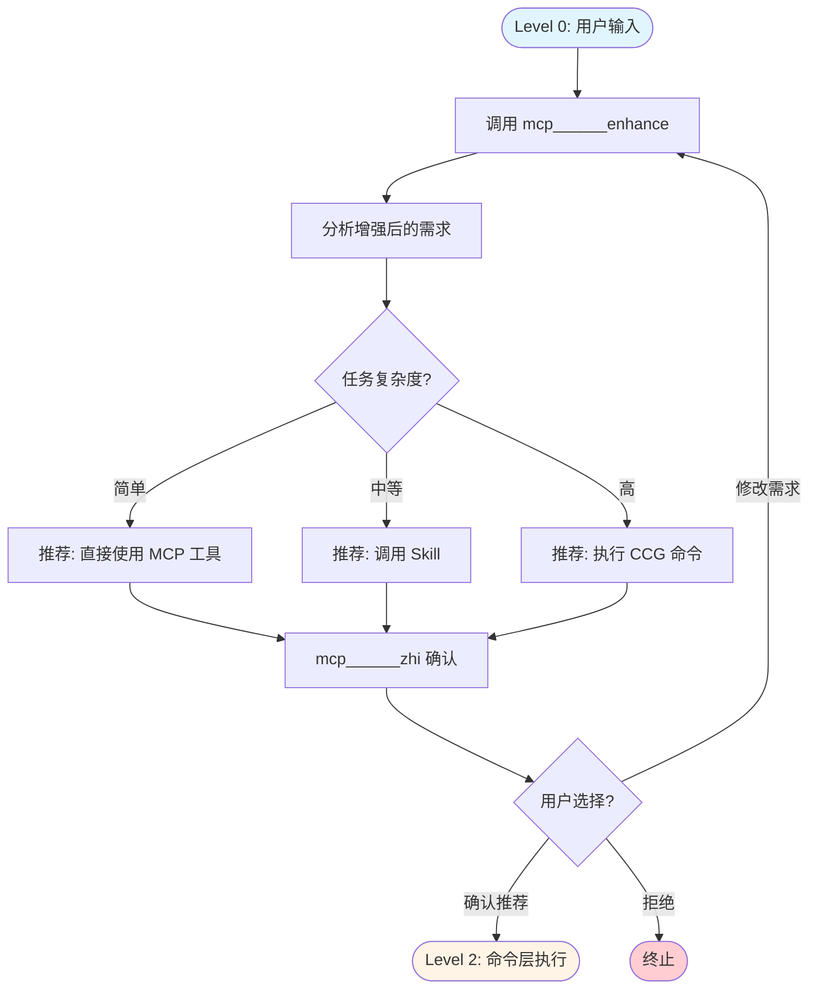
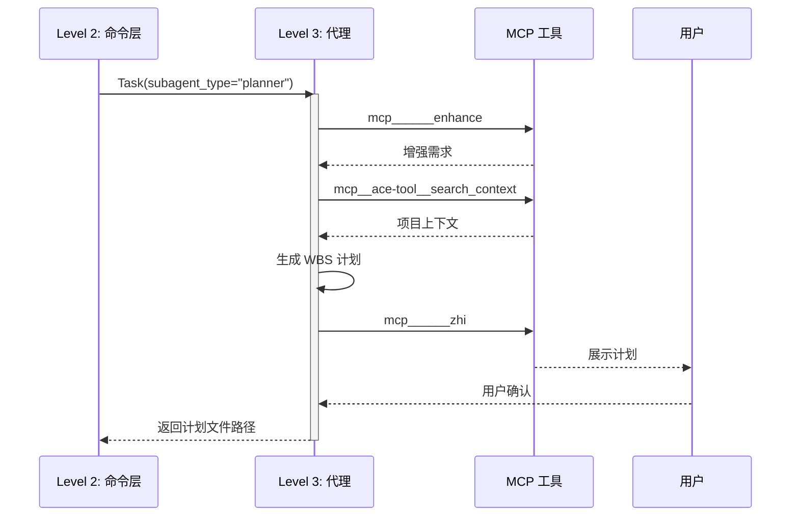
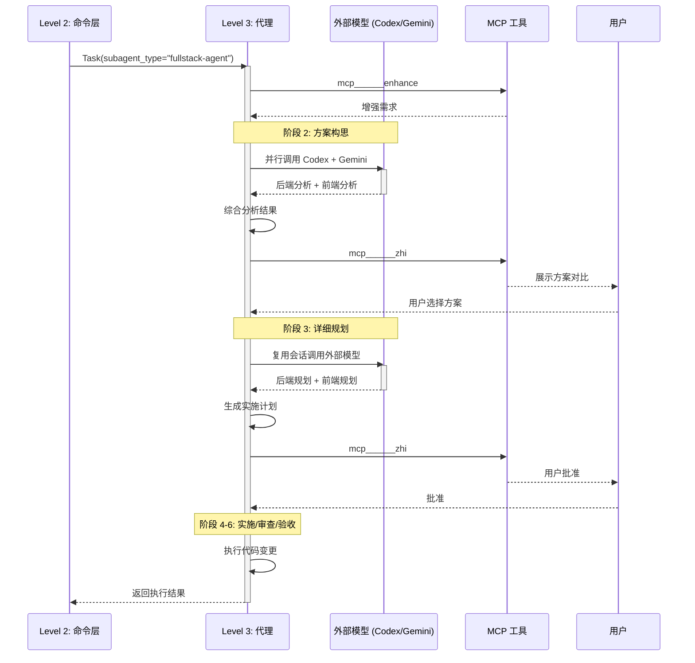
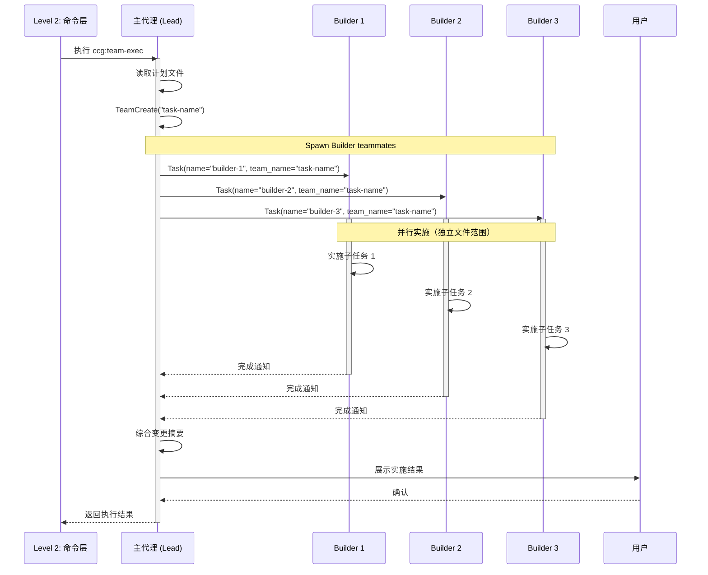

# CCG 系统架构 V2.0 - 四层执行模型

> 本文档定义 CCG 系统的四层执行模型，确保所有命令遵循统一的执行流程。
> 生成时间：2026-02-13
> 版本：V2.0

---

## 核心设计理念

**所有命令必须遵循 Level 0 → Level 1 → Level 2 → Level 3 的执行流程。**

```
Level 0: 用户直接描述需求（自然语言）
  ↓
Level 1: 主代理智能路由（增强需求 → 推荐命令 → 用户确认）
  ↓
Level 2: 命令层执行（注入命令文件到上下文）
  ↓
Level 3: 代理/工具层执行（Task 调用代理 / 外部模型 / MCP 工具）
```

---

## Level 0: 用户输入层

### 输入形式

**1. 自然语言描述**
```
用户: "帮我优化这个项目的架构文档"
用户: "我想添加一个用户认证功能"
用户: "代码审查一下最近的改动"
```

**2. 直接命令调用**
```
用户: /ccg:workflow "优化架构文档"
用户: /ccg:feat "用户认证功能"
用户: /ccg:review
```

### 处理规则

- **自然语言** → 进入 Level 1（主代理智能路由）
- **直接命令** → 跳过 Level 1，直接进入 Level 2

---

## Level 1: 主代理智能路由层

### 职责

1. **增强用户需求**（使用 `mcp______enhance` 或降级方案）
2. **分析任务复杂度**（简单/中等/高复杂度）
3. **推荐执行路径**（MCP 工具 / Skill / CCG 命令）
4. **用户确认**（使用 `mcp______zhi` 展示推荐方案）

### 执行流程



### 推荐策略

#### 1. 简单任务 → 直接使用 MCP 工具

**判定标准**：
- 单步操作
- 无需多阶段工作流
- 不涉及代码变更

**示例**：
```
用户: "搜索一下用户认证相关的代码"
主代理推荐: 使用 mcp__ace-tool__search_context
```

#### 2. 中等复杂度 → 调用 Skill

**判定标准**：
- 需要专业知识
- 单一领域任务
- 可一次性完成

**示例**：
```
用户: "生成一个 CI/CD 配置"
主代理推荐: 调用 ci-cd-generator Skill
```

#### 3. 高复杂度 → 执行 CCG 命令

**判定标准**：
- 多步骤工作流
- 需要阶段性确认
- 涉及代码变更和审查

**示例**：
```
用户: "添加用户认证功能"
主代理推荐: 执行 /ccg:feat（智能功能开发）
理由: 需要分析需求 → 设计方案 → 实施 → 测试的完整流程
```

### 推荐消息格式

```markdown
🔍 **需求分析完成**

**增强后的需求**：
- 目标：优化项目架构文档的结构和可读性
- 范围：.ccg/ARCHITECTURE.md 和 ARCHITECTURE-VISUAL.md
- 技术约束：保持 Mermaid 图表兼容性
- 验收标准：文档结构清晰，层次分明

**任务复杂度**：高（涉及多文件修改和结构重组）

**推荐执行路径**：
1. `/ccg:workflow` - 6 阶段结构化工作流（推荐）
   - 理由：需要研究现有结构 → 设计新结构 → 实施 → 审查的完整流程
   - 预计成本：2-3x（包含多模型协作）

2. `/ccg:feat` - 智能功能开发
   - 理由：如果只是局部优化，可以使用轻量级工作流
   - 预计成本：1x

3. 主代理直接执行
   - 理由：如果需求非常明确，可以跳过多阶段工作流
   - 预计成本：1x

**建议**：选择方案 1（/ccg:workflow），因为架构文档优化需要系统性分析和多轮审查。
```

### 确认选项

```javascript
mcp______zhi({
  message: "推荐消息（见上）",
  is_markdown: true,
  predefined_options: [
    "执行推荐方案（/ccg:workflow）",
    "选择方案 2（/ccg:feat）",
    "选择方案 3（主代理直接执行）",
    "修改需求",
    "取消"
  ],
  project_root_path: "C:/Users/Administrator/.claude"
})
```

---

## Level 2: 命令层执行

### 职责

1. **注入命令文件**（将 `commands/ccg/<name>.md` 注入到上下文）
2. **解析命令参数**（从用户输入或 Level 1 推荐中提取）
3. **路由到执行方式**（Task 调用代理 / 主代理直接执行 / 外部模型）

### 执行方式分类

#### 1. Task 调用代理（20 个命令）

**特征**：
- 需要独立上下文
- 多阶段工作流
- 复杂逻辑封装

**执行模式**：
```javascript
// 主代理读取命令文件
Read({ file_path: "commands/ccg/workflow.md" })

// 注入命令内容到上下文
// （系统自动完成，主代理理解命令的工作流）

// 调用对应的代理
Task({
  subagent_type: "fullstack-agent",
  prompt: "按照 workflow.md 的 6 阶段流程执行：优化架构文档",
  description: "全栈开发工作流"
})
```

**命令列表**：
- `ccg:workflow` → `fullstack-agent`
- `ccg:plan` → `planner`
- `ccg:execute` → `execute-agent`
- `ccg:frontend` → `frontend-agent`
- `ccg:backend` → `backend-agent`
- `ccg:feat` → `fullstack-light-agent`
- `ccg:analyze` → `analyze-agent`
- `ccg:debug` → `debug-agent`
- `ccg:optimize` → `optimize-agent`
- `ccg:test` → `test-agent`
- `ccg:review` → `review-agent`
- `ccg:commit` → `commit-agent`
- `ccg:init` → `init-architect`
- `ccg:spec-init` → `spec-init-agent`
- `ccg:spec-research` → `spec-research-agent`
- `ccg:spec-plan` → `spec-plan-agent`
- `ccg:spec-impl` → `spec-impl-agent`
- `ccg:spec-review` → `spec-review-agent`

#### 2. 主代理直接执行（4 个命令）

**特征**：
- 简单 Git 操作
- 单步工具调用
- 无需独立上下文

**执行模式**：
```javascript
// 主代理读取命令文件
Read({ file_path: "commands/ccg/enhance.md" })

// 主代理直接执行命令逻辑
mcp______enhance({ prompt: "用户原始需求", project_root_path: "..." })
mcp______zhi({ message: "增强结果", ... })
```

**命令列表**：
- `ccg:enhance` - Prompt 增强
- `ccg:rollback` - Git 回滚
- `ccg:clean-branches` - 清理分支
- `ccg:worktree` - Worktree 管理

#### 3. 外部模型 + 主代理协作（4 个命令）

**特征**：
- Agent Teams 工作流
- 并行调用 Codex + Gemini
- 主代理协调和综合

**执行模式**：
```javascript
// 主代理读取命令文件
Read({ file_path: "commands/ccg/team-review.md" })

// 主代理并行调用外部模型
Bash({
  command: "{{CCG_BIN}} --backend codex - \"{{WORKDIR}}\" <<'EOF'...",
  run_in_background: true
})
Bash({
  command: "{{CCG_BIN}} --backend gemini - \"{{WORKDIR}}\" <<'EOF'...",
  run_in_background: true
})

// 等待结果并综合
TaskOutput({ task_id: "codex_task_id" })
TaskOutput({ task_id: "gemini_task_id" })

// 主代理综合分析
mcp______zhi({ message: "综合审查结果", ... })
```

**命令列表**：
- `ccg:team-research` - 并行探索代码库
- `ccg:team-plan` - 并行分析规划
- `ccg:team-exec` - Spawn Builder teammates
- `ccg:team-review` - 双模型交叉审查

---

## Level 3: 代理/工具层执行

### 职责

1. **代理执行工作流**（按命令文件定义的阶段执行）
2. **调用 MCP 工具**（代码检索、用户确认、知识管理等）
3. **调用 Skills**（专业领域任务）
4. **调用外部模型**（Codex/Gemini 分析）
5. **创建 Agent Teams**（并行实施）

### 代理执行模式

#### 模式 1: 单代理独立执行



#### 模式 2: 代理 + 外部模型协作



#### 模式 3: Agent Teams 并行执行



### 工具调用优先级

```
代码检索:
  1. mcp__ace-tool__search_context（精确检索）
  2. mcp______sou（语义扩展，可并行）
  3. Grep/Glob（降级）

Prompt 增强:
  1. mcp______enhance（深度增强，项目上下文 + 对话历史）
  2. mcp__ace-tool__enhance_prompt（轻量增强）
  3. Claude 自增强（按 6 原则结构化补全）

用户确认:
  1. mcp______zhi（Markdown 展示 + 预定义选项）
  2. AskUserQuestion（降级）

网络搜索:
  1. mcp__Grok_Search_Mcp__web_search
  2. 禁用内置 WebSearch

框架文档:
  1. mcp______context7
  2. mcp__Grok_Search_Mcp__web_search（降级）

浏览器操作:
  1. Chrome DevTools MCP
  2. 3 级降级策略（部分受限 → 手动验证 → 暂停执行）

GitHub 操作:
  1. GitHub MCP 工具
  2. gh CLI（降级）
```

---

## 完整执行流程示例

### 示例 1: 自然语言输入 → 智能路由

```
Level 0: 用户输入
  用户: "帮我优化这个项目的架构文档"

Level 1: 主代理智能路由
  1. 调用 mcp______enhance
     输入: "帮我优化这个项目的架构文档"
     输出: {
       目标: "优化 .ccg/ARCHITECTURE.md 的结构和可读性",
       范围: "ARCHITECTURE.md 和 ARCHITECTURE-VISUAL.md",
       技术约束: "保持 Mermaid 图表兼容性",
       验收标准: "文档结构清晰，层次分明"
     }

  2. 分析任务复杂度
     判定: 高复杂度（多文件修改 + 结构重组）

  3. 推荐执行路径
     推荐: /ccg:workflow（6 阶段结构化工作流）
     理由: 需要研究 → 设计 → 实施 → 审查的完整流程

  4. 用户确认
     mcp______zhi({
       message: "推荐执行 /ccg:workflow...",
       predefined_options: ["确认执行", "修改需求", "取消"]
     })
     用户选择: "确认执行"

Level 2: 命令层执行
  1. 读取命令文件
     Read({ file_path: "commands/ccg/workflow.md" })

  2. 调用代理
     Task({
       subagent_type: "fullstack-agent",
       prompt: "按照 workflow.md 的 6 阶段流程执行：优化架构文档",
       description: "全栈开发工作流"
     })

Level 3: 代理执行
  fullstack-agent 执行 6 阶段工作流:

  阶段 1: 研究与分析
    - mcp______enhance（已在 Level 1 完成，复用结果）
    - mcp__ace-tool__search_context（检索现有架构文档）
    - 需求完整性评分: 8/10
    - mcp______zhi（用户确认）

  阶段 2: 方案构思
    - 并行调用 Codex + Gemini（codeagent-wrapper）
    - 综合分析结果
    - mcp______zhi（用户选择方案）

  阶段 3: 详细规划
    - 复用会话调用 Codex + Gemini
    - Claude 综合规划
    - mcp______zhi（用户批准）

  阶段 4: 实施
    - 执行代码变更（Edit/Write）
    - mcp______zhi（用户确认）

  阶段 5: 审查与修复
    - 并行调用 Codex + Gemini 审查
    - 修复发现的问题
    - mcp______zhi（用户确认）

  阶段 6: 验收
    - 对照计划检查
    - mcp______ji（存储经验）
    - mcp______zhi（用户确认完成）

  返回: 执行结果摘要
```

### 示例 2: 直接命令调用 → 跳过路由

```
Level 0: 用户输入
  用户: /ccg:review

Level 1: 主代理智能路由
  跳过（用户直接指定命令）

Level 2: 命令层执行
  1. 读取命令文件
     Read({ file_path: "commands/ccg/review.md" })

  2. 调用代理
     Task({
       subagent_type: "review-agent",
       prompt: "按照 review.md 的流程执行代码审查",
       description: "多维度代码审查"
     })

Level 3: 代理执行
  review-agent 执行审查流程:

  1. 收集变更
     - Bash: git diff
     - Bash: git status

  2. 多模型审查（并行）
     - 并行调用 Codex + Gemini
     - 等待结果

  3. 综合发现
     - 合并审查意见
     - 去重
     - 按严重性分级

  4. 输出审查报告
     - Write: .claude/reviews/YYYYMMDD-review.md

  5. 决策门
     - mcp______zhi（展示发现）
     - 用户选择: 修复 / 跳过

  6. 归档
     - mcp______ji（存储审查结果）

  返回: 审查报告路径
```

---

## 架构优势

### 1. 清晰的层次划分

- **Level 0**：用户友好的输入方式
- **Level 1**：智能路由，降低用户决策成本
- **Level 2**：命令标准化，统一执行入口
- **Level 3**：灵活的执行方式，支持多种协作模式

### 2. 灵活的执行路径

- 自然语言 → 智能推荐 → 用户确认
- 直接命令 → 快速执行
- 支持用户在 Level 1 修改需求或选择其他方案

### 3. 统一的确认机制

- 所有关键决策点使用 `mcp______zhi` 确认
- Markdown 格式展示，支持预定义选项
- 用户可随时终止或修改

### 4. 多模型协作

- 代理内部调用外部模型（Codex/Gemini）
- 并行执行，提高效率
- 会话复用，节省 Token

### 5. 降级策略

- 每个工具都有明确的降级路径
- 确保系统在工具不可用时仍能运行
- 降级时通过 `mcp______zhi` 通知用户

---

## 与 V1.0 的区别

| 维度 | V1.0 | V2.0 |
|------|------|------|
| **层次划分** | 3 层（命令/代理/工具） | 4 层（用户/路由/命令/执行） |
| **用户输入** | 直接命令 | 自然语言 + 直接命令 |
| **智能路由** | 无 | Level 1 智能推荐 |
| **确认机制** | 分散在各命令 | 统一使用 mcp______zhi |
| **执行流程** | 不明确 | Level 0-3 强制流程 |
| **降级策略** | 部分定义 | 全面定义 |

---

## 实施要求

### 1. 所有命令必须遵循 Level 0-3 流程

- 命令文件必须明确定义工作流阶段
- 每个阶段必须有用户确认点
- 必须使用 `mcp______zhi` 进行关键决策确认

### 2. Level 1 路由逻辑必须实现

- 主代理必须先调用 `mcp______enhance`
- 必须分析任务复杂度
- 必须推荐执行路径并说明理由
- 必须通过 `mcp______zhi` 让用户确认

### 3. 降级策略必须完整

- 每个 MCP 工具必须有降级方案
- 降级时必须通过 `mcp______zhi` 通知用户
- 必须记录降级原因

### 4. 文档必须同步更新

- CLAUDE.md 必须更新为 V2.0 架构
- 所有命令文件必须包含 Level 2-3 执行逻辑
- 所有代理文件必须包含 Level 3 工作流定义

---

## 下一步行动

1. **更新 CLAUDE.md**
   - 替换任务路由决策章节
   - 添加 Level 0-3 执行流程说明
   - 更新工具选择约束

2. **更新命令文件**
   - 确保所有命令文件包含完整的工作流定义
   - 添加用户确认点
   - 统一使用 `mcp______zhi`

3. **更新代理文件**
   - 确保所有代理文件包含完整的执行逻辑
   - 添加外部模型调用说明
   - 添加降级策略

4. **更新可视化文档**
   - ARCHITECTURE-VISUAL.md 添加 Level 0-3 流程图
   - 添加智能路由决策树
   - 更新命令-代理映射矩阵

---

## 附录：快速参考

### Level 1 推荐决策表

| 任务特征 | 推荐路径 | 示例 |
|---------|---------|------|
| 单步操作，无代码变更 | MCP 工具 | 代码检索、网络搜索 |
| 单一领域，一次性完成 | Skill | CI/CD 配置、数据库设计 |
| 多步骤，需阶段确认 | CCG 命令 | 功能开发、代码审查 |
| 多模块，需并行实施 | Agent Teams | 大型重构、多模块开发 |

### Level 2 执行方式映射

| 执行方式 | 命令数量 | 特征 |
|---------|---------|------|
| Task 调用代理 | 18 | 独立上下文，多阶段工作流 |
| 主代理直接执行 | 4 | 简单操作，单步完成 |
| 外部模型 + 主代理 | 4 | Agent Teams，并行协作 |

### Level 3 工具优先级

```
1. mcp__ace-tool__search_context（代码检索）
2. mcp______enhance（Prompt 增强）
3. mcp______zhi（用户确认）
4. mcp______ji（知识管理）
5. mcp______context7（框架文档）
6. mcp__Grok_Search_Mcp__web_search（网络搜索）
7. Chrome DevTools MCP（浏览器操作）
8. GitHub MCP（GitHub 操作）
```

---

**版本历史**：
- **V2.0**（2026-02-13）：引入四层执行模型，添加智能路由层
- **V1.0**（2026-02-12）：初始版本，三层架构
