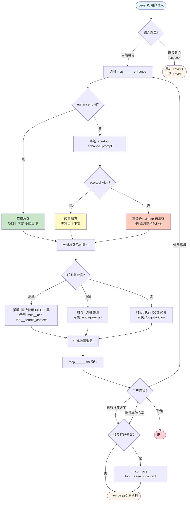
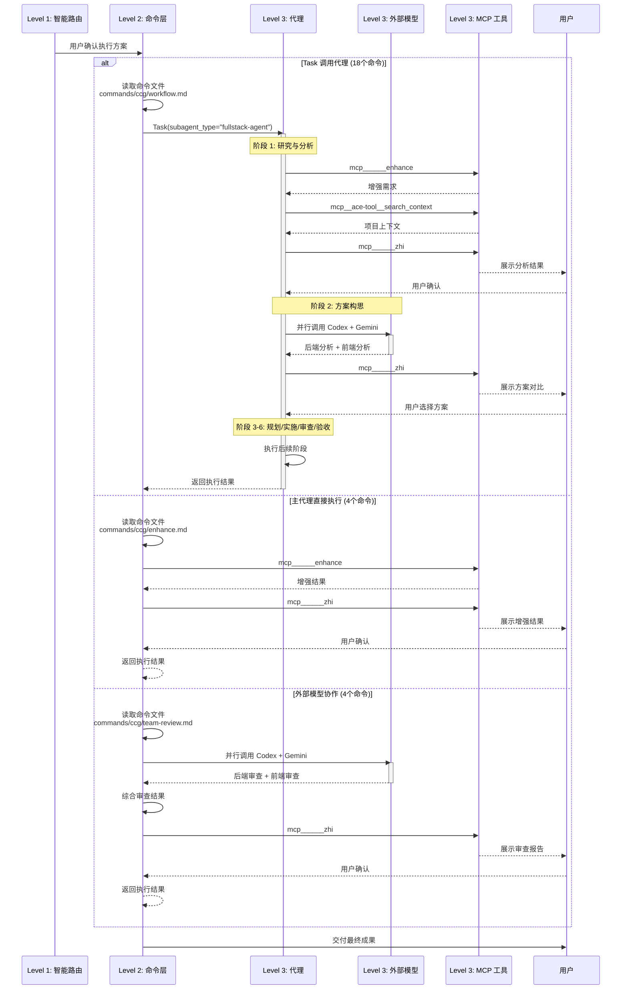
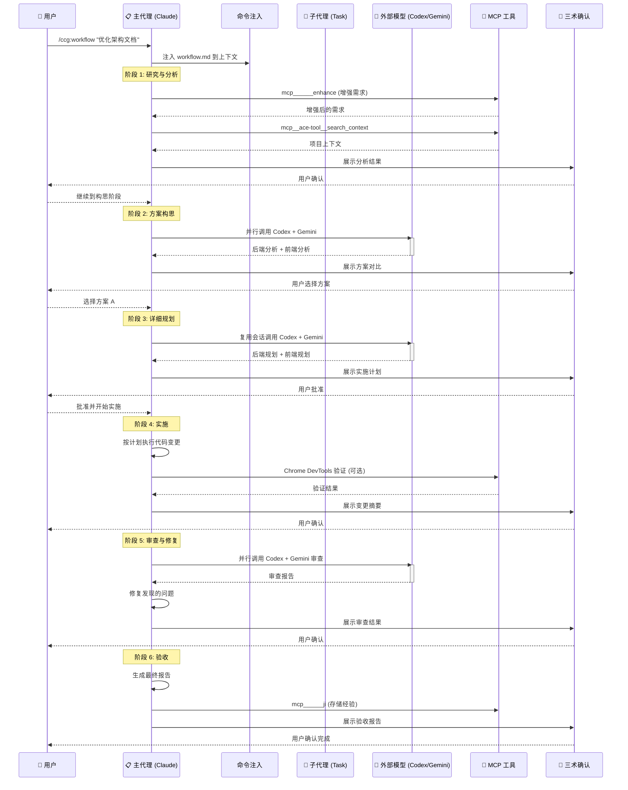

# CCG 系统架构可视化

> 本文档提供 CCG (Claude Code Gateway) 系统的可视化架构图和流程图。
> 生成时间：2026-02-12
> 配合阅读：[ARCHITECTURE.md](./ARCHITECTURE.md)

---

## 目录

1. [系统四层架构图（Level 0-3）](#系统四层架构图level-0-3)
2. [Level 1 智能路由流程图](#level-1-智能路由流程图)
3. [Level 2-3 执行流程图](#level-2-3-执行流程图)
4. [6 阶段工作流图](#6-阶段工作流图)
5. [工具选择决策树](#工具选择决策树)
6. [命令-代理映射矩阵](#命令-代理映射矩阵)
7. [代理工具集配置矩阵](#代理工具集配置矩阵)

---

## 系统四层架构图（Level 0-3）

```mermaid
flowchart TB
    subgraph Level0["Level 0: 用户输入层"]
        U1[自然语言描述<br>"帮我优化架构文档"]
        U2[直接命令调用<br>/ccg:workflow]
    end

    subgraph Level1["Level 1: 主代理智能路由层"]
        R1[增强需求<br>mcp______enhance]
        R2[分析复杂度<br>简单/中等/高]
        R3[推荐执行路径<br>MCP工具/Skill/CCG命令]
        R4[用户确认<br>mcp______zhi]
    end

    subgraph Level2["Level 2: 命令层执行"]
        direction LR
        C1[Task调用代理<br>18个命令]
        C2[主代理直接执行<br>4个命令]
        C3[外部模型协作<br>4个命令]
    end

    subgraph Level3["Level 3: 代理/工具层执行"]
        direction TB
        subgraph Agents["代理 (20个)"]
            A1[fullstack-agent]
            A2[planner]
            A3[frontend-agent]
            A4[backend-agent]
            A5[其他16个...]
        end

        subgraph External["外部模型"]
            E1[Codex<br>后端权威]
            E2[Gemini<br>前端高手]
        end

        subgraph Tools["MCP工具 (5个服务器)"]
            T1[ace-tool]
            T2[三术]
            T3[Grok Search]
            T4[Chrome DevTools]
            T5[GitHub MCP]
        end

        subgraph Skills["Skills (8个)"]
            S1[ui-ux-pro-max]
            S2[database-designer]
            S3[其他6个...]
        end
    end

    U1 --> R1
    U2 -.跳过Level1.-> Level2
    R1 --> R2
    R2 --> R3
    R3 --> R4
    R4 -->|用户确认| Level2
    R4 -->|修改需求| R1
    R4 -->|取消| End([终止])

    C1 --> Agents
    C2 --> Tools
    C3 --> External

    Agents --> Tools
    Agents --> Skills
    Agents --> External
    External -.分析建议.-> Agents

    Agents -.结果返回.-> Level2
    Tools -.结果返回.-> Level2
    External -.结果返回.-> Level2

    Level2 -.交付成果.-> Level0

    style Level0 fill:#e1f5ff
    style Level1 fill:#fff9c4
    style Level2 fill:#fff4e6
    style Level3 fill:#f3e5f5
    style End fill:#ffcdd2
```

**架构说明**：
- **Level 0**：用户输入层，支持自然语言和直接命令两种方式
- **Level 1**：智能路由层，增强需求 → 分析复杂度 → 推荐方案 → 用户确认
- **Level 2**：命令层，根据执行方式路由到代理/主代理/外部模型
- **Level 3**：执行层，代理调用 MCP 工具/Skills/外部模型完成任务

## Level 1 智能路由流程图



**流程说明**：
- **输入类型判断**：自然语言进入智能路由，直接命令跳过
- **三级降级策略**：深度增强 → 轻量增强 → Claude 自增强
- **复杂度分析**：简单/中等/高，对应不同的执行路径
- **用户确认**：展示推荐方案，用户可选择、修改或取消
- **上下文检索**：涉及代码修改时，先检索相关上下文

---

## Level 2-3 执行流程图



**执行模式说明**：
- **Task 调用代理**：独立上下文执行，多阶段工作流，代理内部调用外部模型
- **主代理直接执行**：简单操作，主代理直接调用 MCP 工具完成
- **外部模型协作**：Agent Teams 工作流，主代理并行调用 Codex + Gemini 后综合

---

## 旧版命令调用流程图（已废弃）

> **注意**：此流程图已被 [Level 2-3 执行流程图](#level-2-3-执行流程图) 替代，保留仅供参考。

<details>
<summary>点击展开旧版流程图</summary>



**流程说明**：
- **命令注入**：命令文件内容注入到主代理上下文
- **阶段流转**：每个阶段完成后通过三术(zhi)确认
- **并行调用**：Codex 和 Gemini 并行分析，提高效率
- **会话复用**：后续阶段复用外部模型的会话上下文

</details>

---

## 6 阶段工作流图

```mermaid
flowchart TD
    Start([用户触发命令]) --> S1[🔍 阶段 1: 研究与分析]

    S1 --> S1_1[Prompt 增强]
    S1_1 --> S1_2[上下文检索]
    S1_2 --> S1_3[需求完整性评分]
    S1_3 --> D1{评分 ≥ 7?}
    D1 -->|否| S1_4[补充需求信息]
    S1_4 --> S1_1
    D1 -->|是| C1[三术确认]
    C1 --> U1{用户批准?}
    U1 -->|否| End([终止])
    U1 -->|是| S2[💡 阶段 2: 方案构思]

    S2 --> S2_1[并行调用 Codex + Gemini]
    S2_1 --> S2_2[综合分析结果]
    S2_2 --> S2_3[输出方案对比]
    S2_3 --> C2[三术确认]
    C2 --> U2{用户选择方案?}
    U2 -->|重新构思| S2
    U2 -->|选择方案| S3[📋 阶段 3: 详细规划]

    S3 --> S3_1[复用会话调用外部模型]
    S3_1 --> S3_2[Claude 综合规划]
    S3_2 --> S3_3[生成实施计划]
    S3_3 --> C3[三术确认]
    C3 --> U3{用户批准?}
    U3 -->|修改计划| S3
    U3 -->|批准| S3_4[可选: 创建 feature 分支]
    S3_4 --> S4[⚡ 阶段 4: 实施]

    S4 --> S4_1[按计划执行代码变更]
    S4_1 --> S4_2[Chrome DevTools 验证]
    S4_2 --> C4[三术确认]
    C4 --> U4{用户确认?}
    U4 -->|回滚| S3
    U4 -->|继续| S5[🔬 阶段 5: 审查与修复]

    S5 --> S5_1[并行调用 Codex + Gemini 审查]
    S5_1 --> S5_2[整合审查意见]
    S5_2 --> C5[三术确认]
    C5 --> U5{用户选择?}
    U5 -->|修复问题| S5_3[执行修复]
    S5_3 --> S5
    U5 -->|跳过修复| S6[✅ 阶段 6: 验收]

    S6 --> S6_1[对照计划检查]
    S6_1 --> S6_2[运行测试验证]
    S6_2 --> S6_3[生成最终报告]
    S6_3 --> S6_4[存储经验到 ji]
    S6_4 --> C6[三术确认]
    C6 --> U6{用户选择?}
    U6 -->|确认完成| End
    U6 -->|提交代码| S7[调用 ccg:commit]
    U6 -->|创建 PR| S8[🚀 阶段 7: GitHub PR]
    S7 --> End
    S8 --> S8_1[检测仓库信息]
    S8_1 --> S8_2[生成 PR 标题和描述]
    S8_2 --> S8_3[创建 Pull Request]
    S8_3 --> End

    style Start fill:#e1f5ff
    style End fill:#c8e6c9
    style S1 fill:#fff9c4
    style S2 fill:#ffe0b2
    style S3 fill:#f8bbd0
    style S4 fill:#d1c4e9
    style S5 fill:#b2dfdb
    style S6 fill:#c5e1a5
    style S7 fill:#ffccbc
    style S8 fill:#ce93d8
```



**工作流特点**：
- **止损机制**：评分 <7 或用户未批准时强制停止
- **阶段回退**：阶段 4 失败可回退到阶段 3 重新规划
- **灵活分支**：验收后可选择提交代码或创建 PR

---

## 工具选择决策树

```mermaid
flowchart TD
    Start([任务开始]) --> Q1{任务复杂度?}

    Q1 -->|简单任务| Simple[直接使用 MCP 工具]
    Q1 -->|中等复杂度| Medium[调用 Skill]
    Q1 -->|高复杂度| Complex[委托给 CCG 命令]

    Simple --> Q2{需要什么?}
    Q2 -->|代码检索| T1[mcp__ace-tool__search_context]
    Q2 -->|用户确认| T2[mcp______zhi]
    Q2 -->|知识管理| T3[mcp______ji]
    Q2 -->|网络搜索| T4[mcp__Grok_Search_Mcp__web_search]
    Q2 -->|框架文档| T5[mcp______context7]

    Medium --> Q3{专业领域?}
    Q3 -->|UI 设计| S1[ui-ux-pro-max Skill]
    Q3 -->|数据库| S2[database-designer Skill]
    Q3 -->|Git 操作| S3[git-workflow Skill]
    Q3 -->|CI/CD| S4[ci-cd-generator Skill]
    Q3 -->|文档生成| S5[documentation-writer Skill]

    Complex --> Q4{任务类型?}
    Q4 -->|需求模糊| C1[ccg:analyze]
    Q4 -->|前端开发| C2[ccg:frontend]
    Q4 -->|后端开发| C3[ccg:backend]
    Q4 -->|轻量全栈| C4[ccg:feat]
    Q4 -->|复杂全栈| C5[ccg:workflow]
    Q4 -->|规划| C6[ccg:plan]
    Q4 -->|执行| C7[ccg:execute]
    Q4 -->|代码审查| C8[ccg:review]
    Q4 -->|调试| C9[ccg:debug]
    Q4 -->|测试| C10[ccg:test]
    Q4 -->|性能优化| C11[ccg:optimize]
    Q4 -->|Git 提交| C12[ccg:commit]

    C1 --> A1[analyze-agent]
    C2 --> A2[frontend-agent]
    C3 --> A3[backend-agent]
    C4 --> A4[fullstack-light-agent]
    C5 --> A5[fullstack-agent]
    C6 --> A6[planner]
    C7 --> A7[execute-agent]
    C8 --> A8[review-agent]
    C9 --> A9[debug-agent]
    C10 --> A10[test-agent]
    C11 --> A11[optimize-agent]
    C12 --> A12[commit-agent]

    Q4 -->|并行开发| C13[ccg:team-exec]
    C13 --> A13[Agent Teams]

    T1 --> End([任务完成])
    T2 --> End
    T3 --> End
    T4 --> End
    T5 --> End
    S1 --> End
    S2 --> End
    S3 --> End
    S4 --> End
    S5 --> End
    A1 --> End
    A2 --> End
    A3 --> End
    A4 --> End
    A5 --> End
    A6 --> End
    A7 --> End
    A8 --> End
    A9 --> End
    A10 --> End
    A11 --> End
    A12 --> End
    A13 --> End

    style Start fill:#e1f5ff
    style End fill:#c8e6c9
    style Simple fill:#fff9c4
    style Medium fill:#ffe0b2
    style Complex fill:#f8bbd0
```



**决策原则**：
- **简单任务**：单步操作，直接调用 MCP 工具
- **中等复杂度**：需要专业知识，调用 Skill
- **高复杂度**：多步骤工作流，委托给 CCG 命令和代理

---

## 命令-代理映射矩阵

| # | CCG 命令 | 执行方式 | 调用的代理 | 说明 |
|---|----------|----------|------------|------|
| 1 | `ccg:workflow` | Task 调用 | `fullstack-agent` | 6 阶段全栈开发工作流 |
| 2 | `ccg:plan` | Task 调用 | `planner` | WBS 任务分解规划 |
| 3 | `ccg:execute` | Task 调用 | `execute-agent` | 严格按计划执行 |
| 4 | `ccg:frontend` | Task 调用 | `frontend-agent` | 前端专项开发（Gemini 主导） |
| 5 | `ccg:backend` | Task 调用 | `backend-agent` | 后端专项开发（Codex 主导） |
| 6 | `ccg:feat` | Task 调用 | `fullstack-light-agent` | 智能功能开发（自动识别前/后/全栈） |
| 7 | `ccg:analyze` | Task 调用 | `analyze-agent` | 多模型技术分析 |
| 8 | `ccg:debug` | Task 调用 | `debug-agent` | 假设驱动缺陷定位 |
| 9 | `ccg:optimize` | Task 调用 | `optimize-agent` | 性能分析与优化 |
| 10 | `ccg:test` | Task 调用 | `test-agent` | 测试用例生成 + E2E |
| 11 | `ccg:review` | Task 调用 | `review-agent` | 多维度代码审查 |
| 12 | `ccg:commit` | Task 调用 | `commit-agent` | Conventional Commits 生成 |
| 13 | `ccg:enhance` | 直接执行 | - | 主代理调用 enhance 工具 |
| 14 | `ccg:init` | Task 调用 | `init-architect` | 项目 CLAUDE.md 初始化 |
| 15 | `ccg:rollback` | 直接执行 | - | 主代理交互式 Git 回滚 |
| 16 | `ccg:clean-branches` | 直接执行 | - | 主代理清理 Git 分支 |
| 17 | `ccg:worktree` | 直接执行 | - | 主代理管理 Git Worktree |
| 18 | `ccg:spec-init` | Task 调用 | `spec-init-agent` | OpenSpec 环境初始化 |
| 19 | `ccg:spec-research` | Task 调用 | `spec-research-agent` | 需求转约束集 |
| 20 | `ccg:spec-plan` | Task 调用 | `spec-plan-agent` | 约束集转零决策计划 |
| 21 | `ccg:spec-impl` | Task 调用 | `spec-impl-agent` | 按计划执行 + 多模型审计 |
| 22 | `ccg:spec-review` | Task 调用 | `spec-review-agent` | 合规审查 + 归档 |
| 23 | `ccg:team-research` | 外部模型 + 主代理 | - | Agent Teams 需求研究（约束集） |
| 24 | `ccg:team-plan` | 外部模型 + 主代理 | - | Agent Teams 并行规划（零决策计划） |
| 25 | `ccg:team-exec` | Agent Teams | - | 并行 spawn Builder teammates 实施 |
| 26 | `ccg:team-review` | 外部模型 + 主代理 | - | Agent Teams 双模型交叉审查 |

**执行方式说明**：
- **Task 调用**（20 个）：使用 `Task(subagent_type="xxx")` 启动子代理，独立上下文执行
- **直接执行**（2 个）：主代理直接完成，无需子代理或外部模型
- **Agent Teams**（4 个）：主代理编排 Team 生命周期与并行 Builder 执行

---

## 代理工具集配置矩阵

| 代理 | MCP 工具 | 内置工具 | Skills | 核心职责 |
|------|----------|----------|--------|----------|
| **fullstack-agent** | ace-tool, sou(互补), zhi, ji, context7, uiux_search, uiux_stack, uiux_design_system, tu, Grok search, Chrome DevTools, GitHub MCP | Read/Write/Edit, Glob/Grep, Bash | ui-ux-pro-max, database-designer, ci-cd-generator | 复杂多模块全栈（6 阶段） |
| **planner** | ace-tool, zhi, ji, context7, Grok search | Read/Write/Edit, Glob/Grep, Bash | - | WBS 任务分解 |
| **execute-agent** | ace-tool, zhi, ji, context7, tu, Grok search, Chrome DevTools | Read/Write/Edit, Glob/Grep, Bash | - | 严格按计划执行 + 浏览器验证 |
| **frontend-agent** | ace-tool, zhi, ji, context7, uiux_search, uiux_stack, uiux_design_system, tu, Chrome DevTools | Read/Write/Edit, Glob/Grep, Bash | ui-ux-pro-max, frontend-design | 组件/页面/样式开发 |
| **backend-agent** | ace-tool, zhi, ji, context7, Grok search | Read/Write/Edit, Glob/Grep, Bash | database-designer | API/服务/数据库开发 |
| **fullstack-light-agent** | ace-tool, zhi, ji, context7, uiux_search, uiux_stack, tu, Grok search | Read/Write/Edit, Glob/Grep, Bash | ui-ux-pro-max, database-designer | 中等复杂度单模块全栈 |
| **analyze-agent** | ace-tool, enhance, zhi, ji, uiux_suggest, Grok search | Read/Write/Edit, Glob/Grep, Bash | - | 多模型技术可行性分析 |
| **debug-agent** | ace-tool, zhi, ji, context7, uiux_suggest, Grok search, Chrome DevTools | Read/Write/Edit, Glob/Grep, Bash | - | 假设驱动缺陷定位 |
| **optimize-agent** | ace-tool, zhi, ji, context7, Grok search, Chrome DevTools | Read/Write/Edit, Glob/Grep, Bash | - | 性能分析与优化 |
| **test-agent** | ace-tool, zhi, ji, context7, Grok search, Chrome DevTools | Read/Write/Edit, Glob/Grep, Bash | - | 测试用例生成 + E2E 浏览器测试 |
| **review-agent** | ace-tool, sou(互补), zhi, ji, context7, uiux_suggest, Grok search, Chrome DevTools | Read/Write/Edit, Glob/Grep, Bash | - | 多维度代码审查 + 视觉/A11y 审查 |
| **commit-agent** | zhi, ji | Read/Write/Edit, Glob/Grep, Bash | git-workflow | Conventional Commits 生成 |
| **ui-ux-designer** | ace-tool, zhi, ji, uiux_search, uiux_stack, uiux_design_system, tu, Grok search, Chrome DevTools | Read/Write/Edit, Glob/Grep, Bash | - | UI/UX 设计文档生成 + A11y 验证 |
| **init-architect** | - | Read/Write/Edit, Glob/Grep, Bash | - | 项目 CLAUDE.md 初始化 |
| **get-current-datetime** | - | Bash | - | 获取当前日期时间 |
| **spec-init-agent** | ace-tool, zhi, ji | Read/Write/Edit, Glob/Grep, Bash | - | OpenSpec 环境初始化 |
| **spec-research-agent** | ace-tool, enhance, zhi, ji, Grok search | Read/Write/Edit, Glob/Grep, Bash | - | 需求转约束集 |
| **spec-plan-agent** | ace-tool, enhance, zhi, ji, context7, Grok search | Read/Write/Edit, Glob/Grep, Bash | - | 约束集转可执行计划 |
| **spec-impl-agent** | ace-tool, zhi, ji, Grok search | Read/Write/Edit, Glob/Grep, Bash | - | 计划执行 + 审计 |
| **spec-review-agent** | ace-tool, zhi, ji, Grok search | Read/Write/Edit, Glob/Grep, Bash | - | 合规审查 |

**工具集说明**：
- **ace-tool**：代码检索首选，精确检索；降级到 `mcp______sou`
- **sou**：语义扩展搜索，复杂场景可与 ace-tool 并行使用提高召回率
- **enhance**：三术版利用项目上下文+对话历史深度增强；降级到 `ace-tool enhance_prompt`（轻量，无项目上下文）
- **zhi**：关键决策确认，Markdown 展示
- **ji**：知识存储，跨会话复用经验
- **context7**：框架/库官方文档查询
- **Grok search**：网络搜索，优先于内置 WebSearch
- **Chrome DevTools**：浏览器自动化，3 级降级策略
- **GitHub MCP**：GitHub 操作，降级到 `gh` CLI

---

## 快速参考

### 常见场景到命令的映射

| 场景 | 推荐命令 | 说明 |
|------|----------|------|
| 需求不明确，需要分析 | `ccg:analyze` | 多模型技术可行性分析 |
| 开发新功能（中等复杂度） | `ccg:feat` | 自动识别前/后/全栈 |
| 开发新功能（高复杂度） | `ccg:workflow` | 6 阶段结构化工作流 |
| 只做前端开发 | `ccg:frontend` | Gemini 主导前端专项 |
| 只做后端开发 | `ccg:backend` | Codex 主导后端专项 |
| 有详细计划，需要执行 | `ccg:execute` | 严格按计划执行 |
| 需要生成实施计划 | `ccg:plan` | WBS 任务分解 |
| 代码审查 | `ccg:review` | 双模型交叉验证 |
| 调试问题 | `ccg:debug` | 竞争假设定位 |
| 性能优化 | `ccg:optimize` | 多模型性能分析 |
| 生成测试 | `ccg:test` | 智能路由前/后端测试 |
| Git 提交 | `ccg:commit` | Conventional Commits |
| 项目初始化 | `ccg:init` | 生成 CLAUDE.md 索引 |
| 约束驱动开发 | `ccg:spec-*` | OpenSpec 5 阶段工作流 |

### 工具选择快速决策

```
代码检索 → mcp__ace-tool__search_context
用户确认 → mcp______zhi
知识管理 → mcp______ji
网络搜索 → mcp__Grok_Search_Mcp__web_search
框架文档 → mcp______context7
浏览器操作 → Chrome DevTools MCP
GitHub 操作 → GitHub MCP 工具
```

---

## 更新日志

- **2026-02-13**：架构升级到 V2.0 — 引入四层执行模型（Level 0-3），添加智能路由层，重构所有流程图
- **2026-02-13**：命令重构完成 — 所有 20 个代理命令统一为 Task 调用，移除 codeagent-wrapper 外部模型调用
- **2026-02-13**：架构一致性修复 — 命令层 22→26、补 team-* 命令节点与映射、修正 workflow 执行方式、新增 Agent Teams 分类
- **2026-02-12**：优化 sanshu MCP 集成度 — 扩展 UI/UX 工具链覆盖、sou 升级为互补搜索、enhance/context7 扩展、矩阵同步
- **2026-02-12**：初始版本，包含 4 个 Mermaid 图表和 2 个矩阵表
